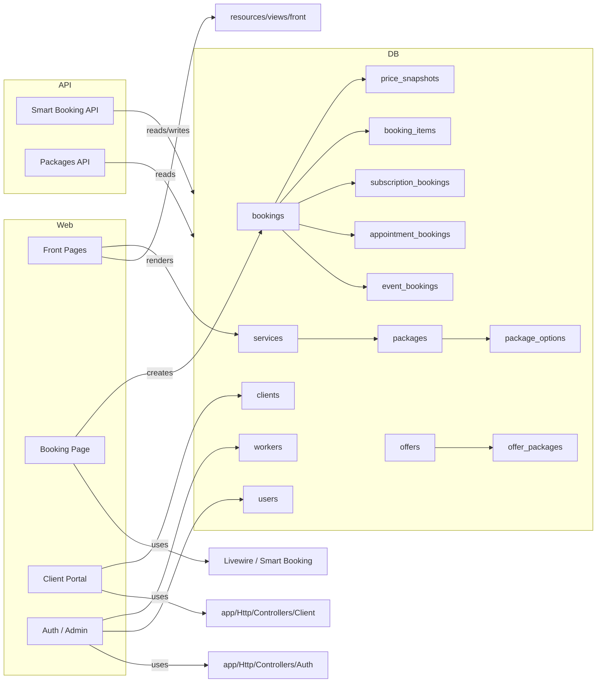

# Project Architecture - onx-edge

## Overview
هذا الملف يصف البنية المعمارية لتطبيق الحجز onx-edge.

### الطبقات الرئيسية
- **Front-end routes**: صفحات الواجهة العامة مثل الصفحة الرئيسية، الخدمات، الحزم، الحجز، الحالة، اتصل بنا، و FAQ.
- **Client Portal**: نظام تسجيل دخول العميل، لوحة تحكم العميل، عرض الحجوزات، الرسائل، الملفات، الصور، المدفوعات، والاشتراكات.
- **Smart Booking API**: واجهة REST لإدارة بيانات الحجز الذكي، الأسعار، التوافر، وتقديم الحجز.
- **Models / Database**: جداول الخدمات، الحزم، الحجوزات، العملاء، المستخدمين، العمال، والمصادر الداعمة.

## المكونات الأساسية
- `routes/web.php`: تعريف المسارات العامة ومسارات بوابة العميل.
- `routes/api.php`: تعريف الـ API الخاصة بالتطبيق وخدمات الحجز الذكي.
- `app/Models`: نماذج الكيانات الأساسية مثل `Service`, `Package`, `Booking`, `Client`, `Worker`, `User`.
- `app/Providers/AppServiceProvider.php`: مشاركة الإعدادات المشتركة وبيانات لوحة العميل.
- `resources/views`: واجهات العرض لكل من الواجهة العامة وبوابة العميل.

## قاعدة البيانات
### جداول الحجز
- `bookings`
- `event_bookings`
- `appointment_bookings`
- `subscription_bookings`
- `booking_items`
- `price_snapshots`

### جداول الخدمات والحزم
- `services`
- `packages`
- `package_options`
- `offers`
- `offer_packages`

### جداول المستخدمين والعملاء
- `users`
- `clients`
- `workers`
- `client_messages`
- `client_files`
- `client_photos`
- `booking_photos`

## Mermaid Diagram

## Notes
- يعتمد التطبيق على Laravel 12.
- المسارات الخاصة بالعملاء تستخدم مزود حراسة `client.auth` و `guest:client`.
- الواجهة العامة تعتمد على خدمات ديناميكية من قاعدة البيانات.
- نظام الحجز يستخدم واجهة `Smart Booking` لتجربة حجز ذكية ومتكاملة.
